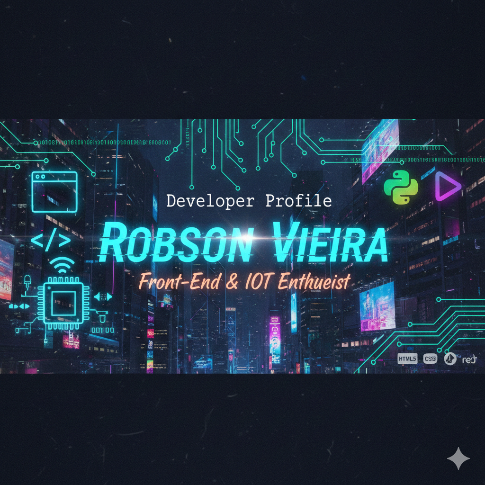

  

## 🚀 Olá, eu sou Robson Vieira 
Desenvolvedor Front-End em Evolução | Entusiasta de IoT & Hardware

Sou um apaixonado por tecnologia que transita entre a lógica do hardware e a criatividade do Front-End. Atualmente focado em construir interfaces modernas e funcionais com o ecossistema JavaScript.

## 🚀 Sobre Mim

- 🌱 Atualmente estou aprendendo HTML5, CSS3, JavaScript.
- 👯 Estou procurando colaborar em projetos que envolvam Front-End e criação de Sites.
- 💬 Você pode me encontrar em https://www.linkedin.com/feed/?trk=guest_homepage-basic_google-one-tap-submit.
- 📫 Como me contatar: tecvander.vieira@gmail.com.

## 🛠️ Minha Stack Tecnológica

- Linguagens: Arduino, C, Python, HTML5, CSS3, JavaScript
- Frameworks: Bootstrap, React
- Ferramentas: Git, VsCode,
  

## 📂 Projetos em Destaque

- **🚗 Motor-digital**: site simulando uma agência de carros de luxo.
- **⚡ Esquemas-eletricos**: Uma plataforma de acesso a conteúdo técnico.
- **🧠 Alfred-adler**: Conceitos de psicologia referente a este autor.
  
## 🌱 Em que estou trabalhando...
- 🔭 Colaborando em projetos de criação de sites e interfaces de usuário.

- 📚 Aprofundando conhecimentos em React.js e Clean Code.

- 💬 Aberto a conversas sobre tecnologia, psicologia e eletrônica.

## 📫 Vamos nos conectar?

- https://www.linkedin.com/feed/?trk=guest_homepage-basic_google-one-tap-submit (link do LinkedIn)

Obrigado por visitar meu perfil! Estou animado para conectar e colaborar com você. 😊
